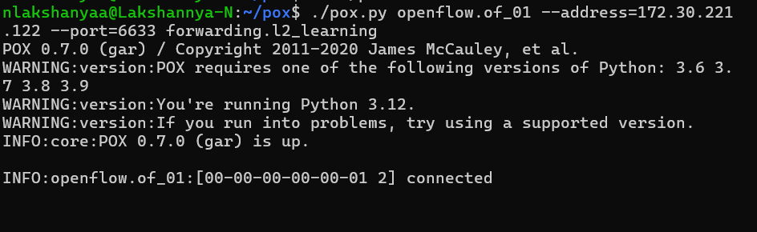
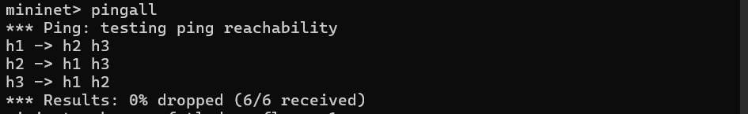
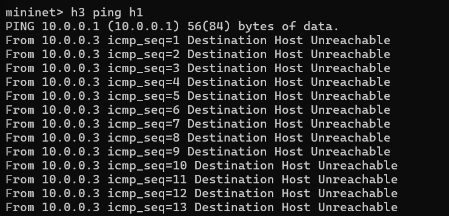
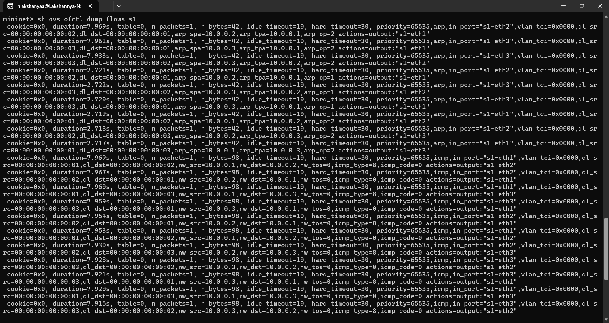
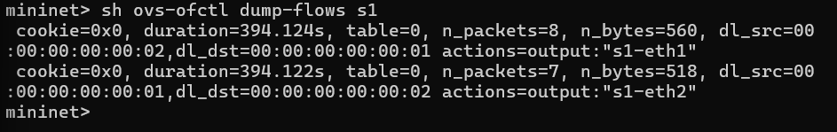
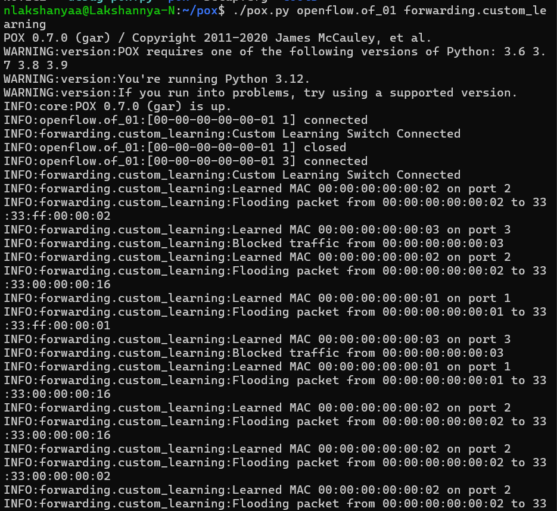
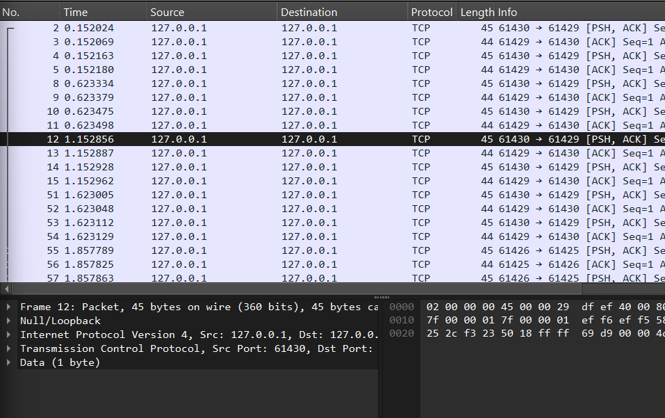

# SDN Learning Switch using Mininet & POX


---

## Project Overview
This project implements a **Layer-2 SDN Learning Switch** using:
- **Mininet** for network emulation  
- **POX** as the OpenFlow controller  

The controller dynamically learns MAC addresses and installs flow rules, enabling efficient forwarding and centralized control.

---

## Problem Statement
Design an SDN-based learning switch that:
- Handles `packet_in` events  
- Learns MAC-to-port mappings  
- Installs OpenFlow match–action rules  
- Demonstrates forwarding and selective traffic blocking  

---

## Objective
- Establish controller–switch communication  
- Implement MAC learning logic  
- Install dynamic flow rules  
- Validate forwarding and policy enforcement  

---

## Topology
```
        s1
      / | \
    h1  h2  h3
```

- **1 Switch (s1)**  
- **3 Hosts (h1, h2, h3)**  

---

## Design Justification
A minimal single-switch topology ensures:
- Clear visibility of controller decisions  
- Easy flow rule analysis  
- Controlled testing (forwarding vs blocking)  
- Focus on SDN logic without routing complexity  

---

## Setup

### Install Dependencies
```bash
sudo apt install mininet -y
git clone https://github.com/noxrepo/pox.git
```

---

## Execution

### 1. Start Controller
```bash
cd ~/pox
./pox.py openflow.of_01 forwarding.custom_learning
```

### 2. Start Mininet
```bash
sudo mn --topo single,3 --controller remote --mac --switch ovsk
```

### 3. Run Tests
```bash
mininet> pingall
mininet> sh ovs-ofctl dump-flows s1
```

---

## Test Scenarios

### Normal Forwarding
```
mininet> pingall
```
✔ All hosts reachable  
✔ Flow rules installed dynamically  

---

### Blocked Host (Policy Enforcement)
```
mininet> h1 ping -c 3 h2
mininet> h3 ping -c 3 h1
```
✔ h1 ↔ h2 works  
✖ h3 traffic blocked  

---

## Performance Analysis

- **Latency:** Initial delay due to controller processing → reduced after flow installation  
- **Throughput:** Stable once flows are installed  
- **Key Insight:**  
  - First packet → handled by controller  
  - Subsequent packets → handled by switch (data plane)  

---

## Flow Table Analysis

### Protocol-Based Flows
- ARP / ICMP rules  
- Fields: `nw_src`, `arp_spa`, `icmp_type`  

### MAC-Based Flows
- Match: `dl_src`, `dl_dst`  
- Action: output port  

**Conclusion:**  
System transitions from protocol handling → efficient Layer-2 forwarding  

---

## Proof of Execution

### Controller Startup


### Connectivity Test


### Blocked Traffic


### Flow Tables



### Controller Logs


### Wireshark (OpenFlow Traffic)


---

## Validation
✔ Controller-switch handshake  
✔ MAC learning implemented  
✔ Flow rules correctly installed  
✔ Selective blocking enforced  
✔ Flow table verified  

---

## Tech Stack
- **Mininet**
- **POX Controller**
- **OpenFlow 1.0**
- **Wireshark**
- **WSL2 (Ubuntu)**

---

## References
- http://mininet.org  
- https://github.com/noxrepo/pox  
- https://opennetworking.org  

---

## Author
**N Lakshanyaa**  
PES University  
Computer Networks / SDN Project  

---
⭐ *If you found this useful, consider starring the repo*
